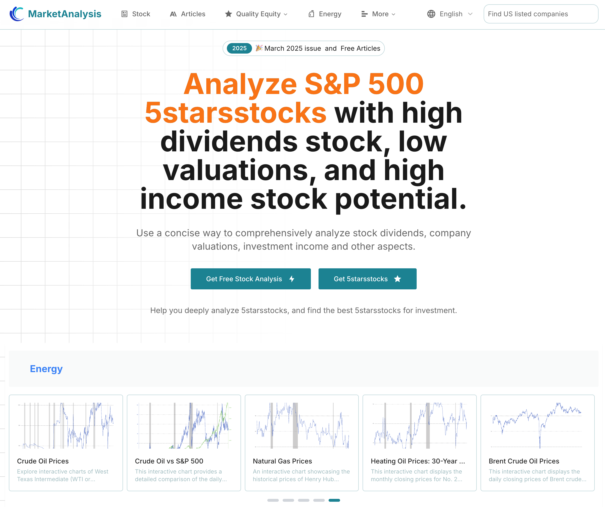

# MarketAnalysis - Stock Market Analysis Platform

## 📊 Project Overview

MarketAnalysis is a comprehensive AI and knowledge base-driven stock market analysis platform designed for investors and financial analysts. The platform provides in-depth analysis of US-listed companies, energy market data, commodity price trends, and historical chart data for various financial derivatives.

### 🚀 Core Features

- **🏢 US Stock Analysis**: Comprehensive coverage of US-listed companies' financial data, valuation analysis, and investment recommendations
- **⚡ Energy Markets**: Real-time data and trend analysis for crude oil, natural gas, renewable energy, and other energy sectors
- **📈 Commodities**: Price monitoring and analysis for precious metals, agricultural products, industrial metals, and other commodities
- **🤖 AI-Driven**: Leveraging artificial intelligence for intelligent analysis and predictions
- **📚 Knowledge Base**: Rich financial knowledge base to help users understand market dynamics
- **📊 Visualization**: Intuitive charts and data visualization tools

### 🛠 Technical Features

- **Real-time Data**: Connected to multiple financial data sources for real-time market information
- **Smart Analysis**: AI algorithm-driven market analysis and trend forecasting
- **User-Friendly**: Clean and intuitive user interface design
- **Mobile Responsive**: Responsive design supporting multiple device access
- **Data Security**: Industry-standard data encryption and security measures

### 🔧 Installation & Usage

#### Requirements
- Node.js 16.0+
- npm or yarn
- Modern browser support

### 📱 Feature Modules

#### Stock Analysis
- Real-time stock price monitoring
- Technical indicator analysis
- Fundamental analysis
- Financial statement interpretation
- Valuation models

#### Energy Sector
- Crude oil price trends
- Natural gas market analysis
- New energy industry dynamics
- Energy policy impact analysis

#### Commodities
- Precious metals price tracking
- Agricultural futures analysis
- Industrial metals supply and demand analysis
- Macroeconomic impact assessment

### 🔗 Featured Stocks & Individual Stock Analysis 

- **5starsstocks**: [https://marketanalysis.cc/5starsstocks](https://marketanalysis.cc/5starsstocks)
  In-depth analysis of top 5-star stocks to support your investment decisions.
- **pegy stock**: [https://www.marketanalysis.cc/stock/NASDAQ:PEGY](https://www.marketanalysis.cc/stock/NASDAQ:PEGY)
  PEGY (NASDAQ:PEGY) stock quotes, financials, and valuation analysis.
- **wrd stock**: [https://www.marketanalysis.cc/stOCK/NASDAQ:WRD](https://www.marketanalysis.cc/stOCK/NASDAQ:WRD)
  WRD (NASDAQ:WRD) historical data, trends, and investment insights.

### 🔮 AI Features

- **Smart Stock Selection**: AI stock selection system based on multi-factor models
- **Risk Assessment**: Intelligent portfolio risk assessment
- **Market Prediction**: Machine learning-driven market trend prediction
- **News Analysis**: Natural language processing for market news analysis

### 📈 Data Sources

- Yahoo Finance API
- Alpha Vantage
- IEX Cloud
- Quandl
- Other authoritative financial data providers

### 🤝 Contributing

We welcome community contributions! Please follow these steps:

1. Fork the project
2. Create your feature branch (`git checkout -b feature/AmazingFeature`)
3. Commit your changes (`git commit -m 'Add some AmazingFeature'`)
4. Push to the branch (`git push origin feature/AmazingFeature`)
5. Open a Pull Request

### 📄 License

This project is licensed under the MIT License - see the [LICENSE](LICENSE) file for details

### 📞 Contact Us

- Project Homepage: [https://github.com/yourusername/marketanalysis](https://github.com/yourusername/marketanalysis)
- Issue Reporting: [Issues](https://github.com/yourusername/marketanalysis/issues)
- Email: admin@pww.com

### 🙏 Acknowledgments

Thanks to all developers and data providers who have contributed to this project.

---

⭐ If this project helps you, please give us a star! 