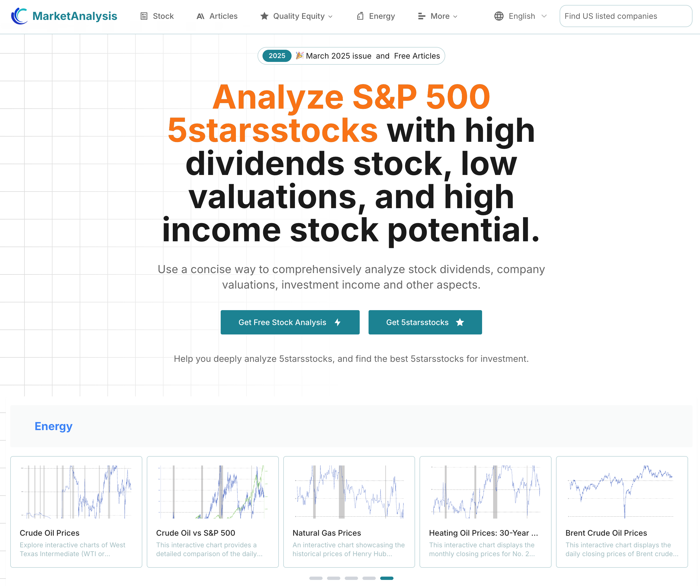

# MarketAnalysis - 주식 시장 분석 플랫폼

## 📊 프로젝트 개요

MarketAnalysis는 투자자와 금융 분석가를 위해 설계된 AI 및 지식 기반 종합 주식 시장 분석 플랫폼입니다. 이 플랫폼은 미국 상장 기업의 심층 분석, 에너지 시장 데이터, 원자재 가격 동향 및 다양한 금융 파생상품의 과거 차트 데이터를 제공합니다.

### 🚀 핵심 기능

- **🏢 미국 주식 분석**: 미국 상장 기업의 재무 데이터, 평가 분석 및 투자 권고사항 종합 제공
- **⚡ 에너지 시장**: 원유, 천연가스, 재생에너지 등 에너지 부문의 실시간 데이터 및 동향 분석
- **📈 원자재**: 귀금속, 농산물, 산업용 금속 등 원자재의 가격 모니터링 및 분석
- **🤖 AI 기반**: 인공지능 기술을 활용한 지능형 분석 및 예측
- **📚 지식 베이스**: 사용자가 시장 동향을 이해할 수 있도록 돕는 풍부한 금융 지식 베이스
- **📊 시각화**: 직관적인 차트 및 데이터 시각화 도구

### 🛠 기술적 특징

- **실시간 데이터**: 여러 금융 데이터 소스에 연결하여 실시간 시장 정보 제공
- **스마트 분석**: AI 알고리즘 기반 시장 분석 및 동향 예측
- **사용자 친화적**: 깔끔하고 직관적인 사용자 인터페이스 디자인
- **모바일 반응형**: 다양한 기기 접근을 지원하는 반응형 디자인
- **데이터 보안**: 업계 표준 데이터 암호화 및 보안 조치

### 🔧 설치 및 사용법

#### 요구사항
- Node.js 16.0+
- npm 또는 yarn
- 최신 브라우저 지원

### 📱 기능 모듈

#### 주식 분석
- 실시간 주가 모니터링
- 기술적 지표 분석
- 기본 분석
- 재무제표 해석
- 평가 모델

#### 에너지 부문
- 원유 가격 동향
- 천연가스 시장 분석
- 신에너지 산업 동향
- 에너지 정책 영향 분석

#### 원자재
- 귀금속 가격 추적
- 농산물 선물 분석
- 산업용 금속 수급 분석
- 거시경제적 영향 평가

### 📈 추천 종목 및 개별 주식 분석  

- **5starsstocks**: [https://marketanalysis.cc/5starsstocks](https://marketanalysis.cc/5starsstocks)
  우수 5성급 주식의 심층 분석, 투자 의사결정 지원.
- **Google**: [https://www.marketanalysis.cc/stock/NasdaqGS:GOOGL](https://www.marketanalysis.cc/stock/NasdaqGS:GOOGL)
  Google (NasdaqGS:GOOGL) 주가, 재무 및 가치 분석.
- **wrd stock**: [https://www.marketanalysis.cc/stock/NASDAQ:WRD](https://www.marketanalysis.cc/stock/NASDAQ:WRD)
  WRD(NASDAQ:WRD) 주가 데이터, 추세 및 투자 인사이트.

### 🔮 AI 기능

- **스마트 종목 선택**: 다인자 모델 기반 AI 종목 선택 시스템
- **위험 평가**: 지능형 포트폴리오 위험 평가
- **시장 예측**: 머신러닝 기반 시장 동향 예측
- **뉴스 분석**: 시장 뉴스 분석을 위한 자연어 처리

### 📈 데이터 소스

- Yahoo Finance API
- Alpha Vantage
- IEX Cloud
- Quandl
- 기타 권위 있는 금융 데이터 제공업체

### 🤝 기여하기

커뮤니티 기여를 환영합니다! 다음 단계를 따라주세요:

1. 프로젝트 포크
2. 기능 브랜치 생성 (`git checkout -b feature/AmazingFeature`)
3. 변경사항 커밋 (`git commit -m 'Add some AmazingFeature'`)
4. 브랜치에 푸시 (`git push origin feature/AmazingFeature`)
5. Pull Request 생성

### 📄 라이선스

이 프로젝트는 MIT 라이선스 하에 있습니다 - 자세한 내용은 [LICENSE](LICENSE) 파일을 참조하세요

### 📞 연락처

- 프로젝트 홈페이지: [https://github.com/yourusername/marketanalysis](https://github.com/yourusername/marketanalysis)
- 이슈 신고: [Issues](https://github.com/yourusername/marketanalysis/issues)
- 이메일: admin@pww.com

### 🙏 감사의 말

이 프로젝트에 기여한 모든 개발자와 데이터 제공업체에 감사드립니다.

---

⭐ 이 프로젝트가 도움이 되었다면 별표를 주세요! 